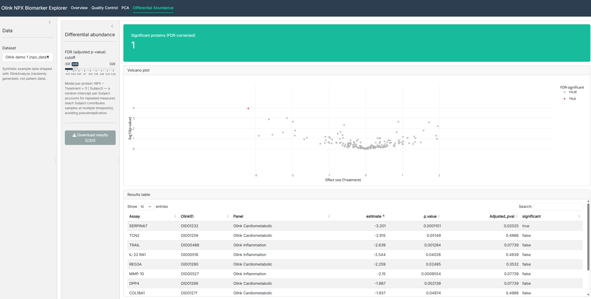

# Olink NPX Biomarker Explorer

An interactive R Shiny app for exploring high-dimensional proteomic data in Olink's NPX (Normalized Protein eXpression) format: quality control, dimensionality reduction (PCA), and differential abundance testing with proper handling of repeated-measures study design.

Live demo: https://18kqux-pablo-gimenez.shinyapps.io/olink-biomarker-explorer/

# What it does
Quality Control — sample- and assay-level QC summaries (warning rates, values below the limit of detection), an interactive per-sample distribution plot, and the ability to flag/exclude failing samples — exclusions propagate to every other tab automatically.
PCA — interactive principal component analysis on the scaled expression matrix, colorable by Treatment / Site / Time, with a table of top protein loadings.
Differential Abundance — per-protein comparison between treatment groups, shown as a volcano plot with a downloadable, FDR-corrected results table.
Data

Uses npx_data1 / npx_data2, the synthetic example datasets shipped with Olink's official OlinkAnalyze R package (CRAN, v5.0.2). These are randomly generated demo data, not real patient measurements — used here to demonstrate the analysis pipeline, not to make any biological claim.

# Methods

Dimensionality reduction: each protein's NPX values are standardized (mean 0, sd 1) before PCA, so no single high-variance protein dominates the components for reasons unrelated to biology.

Differential abundance: the study design is repeated-measures — each Subject contributes multiple samples (one per timepoint), so a naive t-test/ANOVA treating every sample as independent understates the true variance and inflates significance (pseudoreplication). Each protein is instead tested with a linear mixed model, NPX ~ Treatment + (1 | Subject), via OlinkAnalyze::olink_lmer() — a random intercept per Subject separates between-subject variability from within-subject noise before estimating the Treatment effect. P-values are corrected for multiple testing across all 184 proteins with the Benjamini-Hochberg procedure (FDR).

A concrete finding from building this

Running the naive approach first (independent t-test per protein, ignoring the Subject structure) on npx_data1 found 14 proteins significant at FDR < 0.05. Re-running with the mixed model above — correctly accounting for repeated measures — dropped that to 1 protein (SERPINA7). This is the expected and correct behavior: pseudoreplication artificially inflates the apparent sample size (156 samples vs. the true 52 independent subjects), understating variance and producing false positives. It's a concrete illustration of why study design has to inform the statistical model, not just the choice of test.

# Tech stack

R, Shiny (modules), bslib, OlinkAnalyze, lme4/lmerTest, ggplot2 + plotly, DT, renv for dependency locking.

# Repo structure
app.R                    # UI + server shell; mounts modules
R/
  data_access.R          # loading demo data / uploads, dataset summaries
  qc.R                   # sample/assay QC, missingness, exclusion logic
  stats.R                # PCA and mixed-model differential abundance
  mod_qc.R               # QC tab (Shiny module)
  mod_pca.R               # PCA tab (Shiny module)
  mod_diffab.R            # Differential abundance tab (Shiny module)
notebooks/
  01_explore_data.qmd    # exploratory prototyping, pre-app
tests/testthat/          # unit tests for R/qc.R and R/stats.R
renv.lock                # locked package versions
Running locally
r
# Install renv if needed, then restore the exact package versions used:
install.packages("renv")
renv::restore()

# Run the app:
shiny::runApp()

Developed and deployed from Posit Cloud (browser-based RStudio, no local R install required).

Testing
r
testthat::test_dir("tests/testthat")
Reproducibility

Package versions are locked via renv (renv.lock, committed to the repo). renv::restore() reconstructs the exact environment this app was built and tested with.

Known limitations / next steps
UMAP as an alternative, non-linear dimensionality-reduction view
Upload support for real NPX exports via OlinkAnalyze::read_npx()
Effect-size filtering alongside the FDR threshold in the volcano plot
Author

Pablo Giménez — MSc Biomedical Engineering, pivoting toward bioinformatics / precision medicine.
